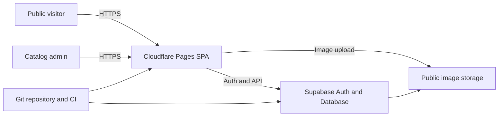

## Executive summary

The highest-risk paths are catalog integrity loss through compromised admin credentials,
authorization-policy drift, and malicious or orphaned public uploads. The current design
reduces those risks with database-enforced admin membership, mandatory MFA for writes,
bucket restrictions, client image validation, and CI checks. Residual risk is concentrated
in hosted Supabase configuration, recovery ownership, and operational verification.

## Scope and assumptions

- In scope: `frontend/src`, `frontend/public/_headers`, `supabase/migrations`,
  `supabase/tests`, `.github/workflows/ci.yml`, and deployment documentation.
- Runtime: public React SPA on Cloudflare Pages communicating directly with one
  client-owned Supabase project over HTTPS/WSS.
- Assumption: one or very few trusted administrators; no customer authentication,
  checkout, payments, or private customer records.
- Out of scope: Supabase and Cloudflare internal implementation, administrator endpoint
  security, domain registrar security, and optional future R2 backup.
- Open questions: final production domain, actual number of administrators, and whether
  customer accounts or private data will ever be introduced.

## System model

### Primary components

- React/Vite public catalog and admin UI (`frontend/src/App.jsx`).
- Supabase Auth, PostgreSQL/RLS, and public Storage (`frontend/src/supabaseClient.js`,
  `supabase/migrations/202607270003_admin_authorization.sql`).
- Cloudflare Pages static delivery and response headers (`frontend/public/_headers`).
- GitHub Actions build/test pipeline (`.github/workflows/ci.yml`).

### Data flows and trust boundaries

- Internet visitor → Cloudflare SPA: routes, search terms, and catalog reads over HTTPS;
  React escapes text and CSP limits executable sources.
- Browser SPA → Supabase Data API: anonymous reads and authenticated mutations over
  HTTPS; RLS is the authorization boundary.
- Administrator → Supabase Auth: email/password and TOTP; write policies require explicit
  membership and `aal2`.
- Administrator browser → Storage: decoded image bytes and metadata; browser validation,
  bucket MIME/size limits, and storage RLS apply.
- Developer repository → Cloudflare/Supabase: reviewed build artifacts and ordered SQL
  migrations; CI validates formatting, tests, build, seed consistency, and audit policy.

#### Diagram

## Assets and security objectives

| Asset | Why it matters | Security objective (C/I/A) |
|---|---|---|
| Catalog records | Public business information must remain accurate | I/A |
| Product images | Public assets affect reputation, cost, and availability | I/A |
| Admin credentials and sessions | Permit catalog-wide mutation | C/I |
| Admin membership | Defines the authorization boundary | C/I |
| Supabase/Cloudflare ownership | Required for recovery after handoff | C/I/A |
| Build and migration artifacts | Determine deployed code and database policy | I/A |

## Attacker model

### Capabilities

- Remote anonymous users can enumerate public catalog records and image URLs.
- Attackers can submit arbitrary search/route values and attempt direct Supabase API or
  Storage calls using the public anon key.
- A credential thief may obtain an admin password but not necessarily the TOTP device.
- A malicious authenticated non-admin can craft requests outside the browser UI.

### Non-capabilities

- Attackers are not assumed to control the client-owned Supabase/Cloudflare accounts,
  source repository, administrator device, or DNS.
- Anonymous visitors cannot legitimately upload files or receive service-role secrets.

## Entry points and attack surfaces

| Surface | How reached | Trust boundary | Notes | Evidence |
|---|---|---|---|---|
| Public catalog | Browser routes/search | Internet → SPA/API | Anonymous reads intended | `frontend/src/api.js` |
| Admin login/MFA | `/admin/login`, `/admin/mfa` | Admin → Auth | Password plus TOTP | `frontend/src/pages/admin/AuthContext.jsx` |
| Database mutations | Supabase JS calls | Browser → PostgreSQL | RLS must authorize every write | `supabase/migrations/202607270003_admin_authorization.sql` |
| Image upload | Admin file picker | Local file → Storage | Active/spoofed files and size abuse | `frontend/src/utils/validateImageFile.js` |
| Deployment headers | Every page response | Cloudflare → Browser | CSP/clickjacking protection | `frontend/public/_headers` |
| CI/dependencies | Pull request/build | Repository → deployment | Supply-chain and artifact integrity | `.github/workflows/ci.yml` |

## Top abuse paths

1. Attacker creates or obtains a normal Auth account → calls mutation APIs directly →
   RLS rejects the request because no admin membership exists.
2. Attacker steals an admin password → signs in at AAL1 → table and storage writes remain
   blocked until TOTP produces AAL2.
3. Compromised admin uploads renamed HTML/SVG as PNG → signature/decoder rejects it;
   bucket MIME allowlist provides an additional boundary.
4. Policy regression restores authenticated-user writes → any account alters catalog →
   SQL assertions and review must detect the legacy policy.
5. Admin upload succeeds but database update fails → object becomes orphaned and incurs
   cost → Phase 3 rollback/orphan reconciliation is required.
6. Project ownership or TOTP device is lost → catalog administration is unavailable →
   client-owned Supabase recovery procedure restores membership/factors.
7. Dependency or build compromise injects browser code → sessions and catalog writes are
   exposed → lockfile, CI audit, CSP, and MFA reduce likelihood/impact.

## Threat model table

| Threat ID | Threat source | Prerequisites | Threat action | Impact | Impacted assets | Existing controls (evidence) | Gaps | Recommended mitigations | Detection ideas | Likelihood | Impact severity | Priority |
|---|---|---|---|---|---|---|---|---|---|---|---|---|
| TM-001 | Remote attacker | Admin password theft | Authenticate and alter catalog | Catalog-wide integrity loss | Records, images | MFA/AAL2 RLS (`202607270003_admin_authorization.sql`) | Hosted MFA settings require verification | Enforce TOTP and retain recovery ownership | Auth audit logs; unexpected mutations | Medium | High | high |
| TM-002 | Authenticated non-admin | Public signup or leaked account | Call Data/Storage APIs directly | Unauthorized writes | Records, images | Membership helper and admin-only RLS | Runtime policies not yet tested remotely | Disable signup/providers; run three-account test | Alert on denied mutations | Medium | High | high |
| TM-003 | Compromised admin | Valid AAL2 session | Upload malicious/oversized content | Stored content abuse and cost | Images, availability | Signature/decode checks and bucket restrictions | Browser checks are bypassable by a privileged client | Keep strict bucket policy; consider server inspection if admins expand | Storage MIME/size inventory | Low | Medium | medium |
| TM-004 | Operational error | Failed DB write after upload | Leave unreferenced object | Storage leak/cost | Storage availability/cost | Random names avoid overwrite (`frontend/src/api.js`) | No rollback/reconciler yet | Implement Phase 3 rollback and orphan report | Scheduled orphan inventory | Medium | Low | medium |
| TM-005 | Developer/supply chain | Malicious dependency or CI change | Ship injected browser bundle | Session theft and mutation | Credentials, catalog | Lockfile, CI, CSP (`ci.yml`, `_headers`) | Router advisory and no deployed-header proof | Upgrade fixed router release; inspect production headers | Dependency alerts and CSP reports | Low | High | medium |
| TM-006 | Account owner error | Lost project/TOTP access | Prevent legitimate administration | Extended outage | Project ownership, availability | Recovery runbook (`PHASE_2_SECURITY_OPERATIONS.md`) | Depends on client retaining account access | Store ownership/recovery details with client | Quarterly ownership check | Medium | Medium | medium |

## Criticality calibration

- Critical: anonymous database write bypass; committed service-role key; deploy pipeline
  takeover enabling arbitrary production code.
- High: stolen admin credentials bypassing MFA; non-admin mutation access; destructive
  catalog-wide deletion.
- Medium: orphaned storage growth; bypassable client-only file checks with admin access;
  missing production security headers.
- Low: public enumeration of intentionally public products; isolated invalid search input;
  noisy denied authorization attempts.

## Focus paths for security review

| Path | Why it matters | Related Threat IDs |
|---|---|---|
| `supabase/migrations/202607270003_admin_authorization.sql` | Defines membership, MFA, and storage authorization | TM-001, TM-002 |
| `frontend/src/pages/admin/AuthContext.jsx` | Coordinates session, membership, and AAL state | TM-001, TM-002 |
| `frontend/src/api.js` | Performs every database and media mutation | TM-002, TM-004 |
| `frontend/src/utils/validateImageFile.js` | Parses attacker-influenced local files | TM-003 |
| `frontend/public/_headers` | Browser-side defense in depth | TM-005 |
| `.github/workflows/ci.yml` | Controls tested deployment inputs | TM-005 |
| `docs/PHASE_2_SECURITY_OPERATIONS.md` | Defines handoff and account recovery | TM-006 |
